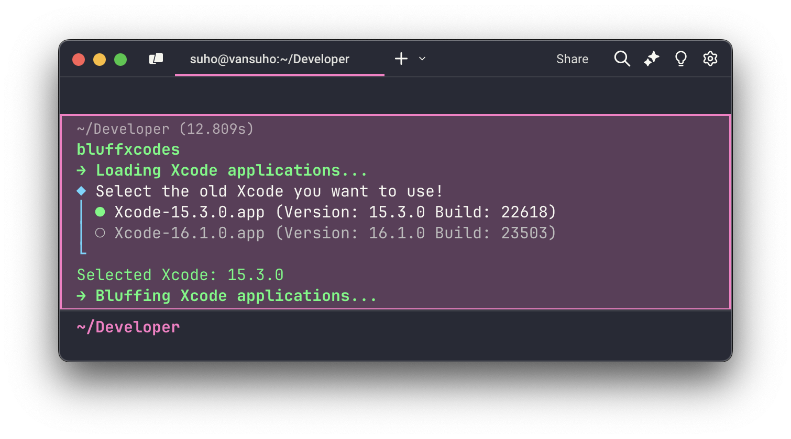

# BluffXcodes

A command line tool to help developers work with multiple Xcode versions by temporarily modifying the bundle version of Xcode that "bluff" the system about which Xcode version is being used. This is particularly useful when you need to use an older Xcode version while maintaining compatibility with newer macOS requirements.

This repository also demonstrates the usage of **OpenAI Codex** for automating updates and contributions.

<p align="center">
    <picture>
      
    </picture>
</p>

## Prerequisites

- macOS Sonoma (14.0) or later.
- One Xcode version installed.
  - It can be older than the supported version for your macOS.
- Full Disk Access permission granted to your terminal application (Terminal, iTerm2, Warp, etc.).

To grant **Full Disk Access**:
1. Open **System Settings**.
2. Navigate to **Privacy & Security** > **Full Disk Access**.
3. Add your terminal application to the list of allowed apps.

## Installation

### Using [Mint](https://github.com/yonaskolb/Mint) (Recommended)
If you do not have [Mint](https://github.com/yonaskolb/Mint) installed, use [Homebrew](https://brew.sh/) to install it:

```bash
brew install mint
```


```bash
mint install suho/bluffxcodes
```

For more information, see the [Mint documentation](https://github.com/yonaskolb/Mint).

### Using Homebrew

If you prefer installing directly with Homebrew:

```bash
brew tap suho/bluffxcodes
brew install bluffxcodes
```

### From Source
1. Clone the repository

```bash
git clone https://github.com/suho/bluffxcodes.git
```

2. Build and install

```bash
cd bluffxcodes
swift build -c release
cp -f .build/release/bluffxcodes /usr/local/bin/bluffxcodes
```

## Usage

Simply run the command in your terminal:

```bash
bluffxcodes
```

The tool will automatically:

1. Detect your installed Xcode versions in the background.
2. Update the bundle version for each older Xcode to match the supported build for your macOS and attempt to open it.
3. Display a list of Xcode versions that opened successfully.

From this point on, you can use the selected Xcode as normal (e.g., open it from the dock, Spotlight, etc.).

## Contributing

Contributions are welcome! Please feel free to submit a Pull Request.

## Credits
- Inspired by discussions in the [iOS Developers Slack](https://ios-developers.slack.com/) community.
- Special thanks to [@aaronpearce](https://github.com/aaronpearce) for the original idea.

## License

This project is licensed under the MIT License - see the [LICENSE](./LICENSE) file for details.
